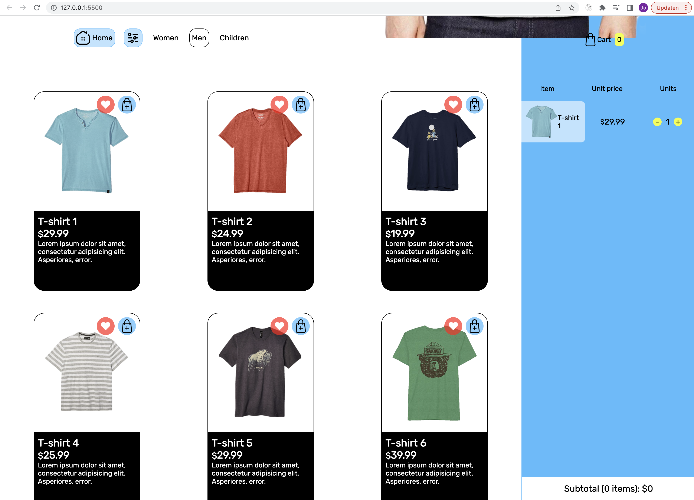

# Vanilla Javascript tutorial "Create a shopping cart"

### [youtube tutorial](https://www.youtube.com/watch?v=UcrypywtAm0)

## Modern JavaScript syntax

- Manipulate the DOM with JavaScript.
- Render informations from a JavaScript object to the user interface.
- Use of Leteral expression (backticks, multi-line string).
- Using of Array.forEach() method.
- Using of Array.some() method.
- Using of Array.map() method.
- Using of Array.filter() method.
